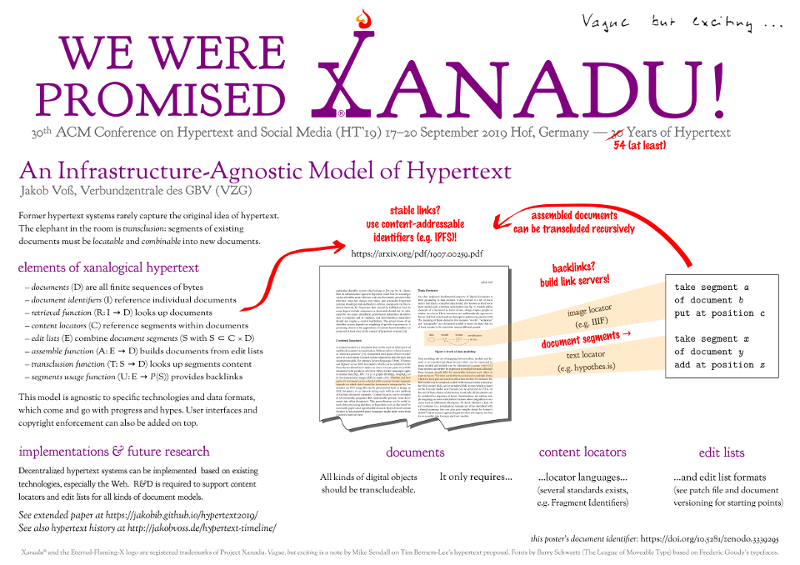

This git-repository contains the article **Infrastructure-Agnostic Hypertext** and related publications.  The paper (4 pages) was originally submitted to the [ACM Conference on Hypertext and Social Media](https://ht.acm.org/ht2019/) (HT' 2019) and rejected for reasons listed in the reviews. A minor revised version has been published at **<https://arxiv.org/abs/1907.00259>**. The HTML version of this version is available at **<https://jakobib.github.io/hypertext2019/>**.

Another shortened version of the article is included in the proceedings as poster abstract (see subdirectory `short-version` and HTML version at <https://jakobib.github.io/hypertext2019/short-version.html>). The official DOI is <https://doi.org/10.1145/3342220.3344922>.

The poster **We were promised Xanadu! An Infrastructure-Agnostic Model of Hypertext** has been published at <https://doi.org/10.5281/zenodo.3339295>.

## Source files

The article is written in Pandoc Markdown syntax. Bibliographic reference data has been entered into Wikidata.

| filename  | format | description |
|-----------|--------|-------------|
| `infrastructure-agnostic-hypertext.md` | Pandoc Markdown | the article text
| `metadata.yaml` | YAML | article metadata
| `interactions.yaml` | YAML | comments published with the article
| `wcite.json` | CSL JSON | bibliographic data extracted from Wikidata
| `wcite.yaml` | YAML | mapping of citation keys to Wikidata identifiers and additional bibliographic data
| `acm-sig-proceedings.csl` | Citation Style Language | Bibliographic citation style provided by ACM (extened by URL field)
| `ACM-Reference-Format.bst` | BibTeX Style Document | Bibliographic citation style provided by ACM
| `acmart.cls` | LaTeX document style  | provided by ACM
| `Makefile` | Makefile | rules how to process files
| `tikz2svg.sh` | Bash script | convert TikZ picture source to SVG
| `template.tex` | Pandoc LaTeX template | LaTeX file which document content is inserted into
| `tex.yaml` | YAML | Pandoc metadata for LaTeX conversion
| `template.html` | Pandoc HTML template | HTML file which document content is inserted into

The poster has been handcrafted with Inkscape (file `poster.svg`).

## Requirements

Required steps to process the document from sources:

* install pdflatex and additional TeX modules:

   `sudo apt-get install texlive-latex-base texlive-generic-extra`

* install [wcite](http://wikicite.org/wcite/)

   `npm install` (requires to [install npm](https://www.npmjs.com/get-npm))

* [install pandoc](https://pandoc.org/installing), at least version 2.0

* install [jq](https://stedolan.github.io/jq/)

   `sudo apt-get install jq`

* ...

## License

All content can be used freely (CC Zero) unless stated otherwise in the file headers.
